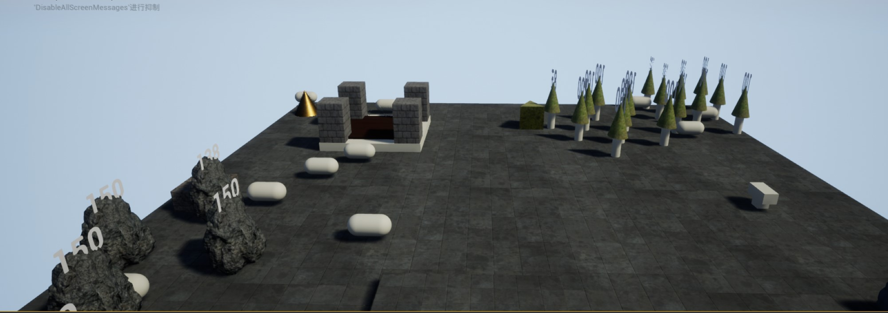
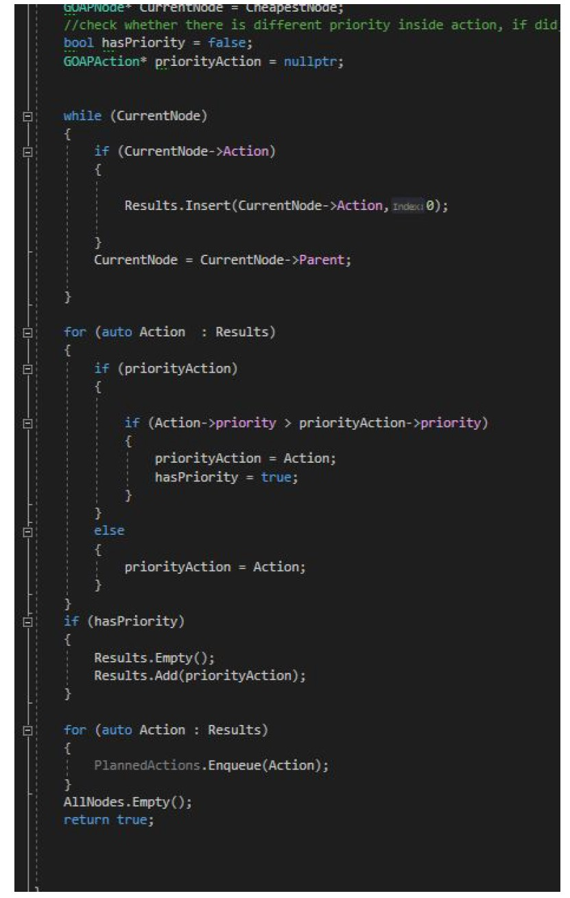

# Goal-Oriented-Action-Planning-Visualization-Project

<div id="top"></div>
<!--
*** Thanks for checking out the Best-README-Template. If you have a suggestion
*** that would make this better, please fork the repo and create a pull request
*** or simply open an issue with the tag "enhancement".
*** Don't forget to give the project a star!
*** Thanks again! Now go create something AMAZING! :D
-->


<!-- PROJECT SHIELDS -->
<!--
*** I'm using markdown "reference style" links for readability.
*** Reference links are enclosed in brackets [ ] instead of parentheses ( ).
*** See the bottom of this document for the declaration of the reference variables
*** for contributors-url, forks-url, etc. This is an optional, concise syntax you may use.
*** https://www.markdownguide.org/basic-syntax/#reference-style-links
-->
[![Contributors][contributors-shield]][contributors-url]
[![Forks][forks-shield]][forks-url]
[![Stargazers][stars-shield]][stars-url]
[![Issues][issues-shield]][issues-url]
[![MIT License][license-shield]][license-url]
[![LinkedIn][linkedin-shield]][linkedin-url]


<!-- PROJECT LOGO -->
<br />
<div align="center">
  <a href="https://github.com/pt4300/Goal-Oriented-Action-Planning-Visualization-Project">
    
  </a>

<h3 align="center">Goal-Oriented-Action-Planning-Visualization-Project</h3>

  <p align="center">
    This project uses the GOAP architecture to implement an automated planning
system that allows agents to automatically assess and plan a series of actions to
achieve a goal. In this project, a virtual world containing a resource collector and
builder cooperate with each other to accomplish building a construction via
automatically populated series of actions to finish the final goal.
    <br />
    <a href="https://github.com/pt4300/Goal-Oriented-Action-Planning-Visualization-Project"><strong>Explore the docs »</strong></a>
    <br />
    <br />
    <a href="https://github.com/pt4300/Goal-Oriented-Action-Planning-Visualization-Project/issues">Report Bug</a>
    ·
    <a href="https://github.com/pt4300/Goal-Oriented-Action-Planning-Visualization-Project/issues">Request Feature</a>
  </p>
</div>


<!-- TABLE OF CONTENTS -->
<details>
  <summary>Table of Contents</summary>
  <ol>
    <li>
      <a href="#about-the-project">About The Project</a>
      <ul>
        <li><a href="#built-with">Built With</a></li>
      </ul>
    </li>
    <li>
      <a href="#getting-started">Getting Started</a>
      <ul>
        <li><a href="#prerequisites">Prerequisites</a></li>
        <li><a href="#installation">Installation</a></li>
      </ul>
    </li>
    <li><a href="#usage">Discussion </a></li>
    <li><a href="#roadmap">Roadmap</a></li>
    <li><a href="#contributing">Contributing</a></li>
    <li><a href="#license">License</a></li>
    <li><a href="#contact">Contact</a></li>
  </ol>
</details>


<!-- ABOUT THE PROJECT -->
## About The Project

![Product Name Screen Shot][product-screenshot]

GOAP stands for Goal Oriented Planning System, it is an automated planning
system that develops based on Stanford research institute problem solver. The
system contains several core components that allow the agent to find the most
suitable action based on the current world state and their desired goal. These
components respectively are finite state machine, actions, world states & goals,
planner and agent. A detailed discussion on each component implementation in this
project will be presented in the discussion section.


<p align="right">(<a href="#top">back to top</a>)</p>


### Built With

* [![cpp][cpp]][cpp-url]
* [![unreal][unreal]][unreal-url]

<p align="right">(<a href="#top">back to top</a>)</p>


<!-- GETTING STARTED -->
## Getting Started

This is an example of how you may give instructions on setting up your project locally.
To get a local copy up and running follow these simple example steps.

### Prerequisites

This is an example of how to list things you need to use the software and how to install them.

Unreal Engine 4.24.3
Visual Studio 2017(Recommended)

### Installation

1. Download [Visual Studio](https://visualstudio.microsoft.com/downloads/) and [Unreal Engine](https://www.epicgames.com/id/login?lang=en-US&noHostRedirect=true&redirectUrl=https%3A%2F%2Fstore.epicgames.com%2Fen-US%2Fdownload&client_id=875a3b57d3a640a6b7f9b4e883463ab4&prompt=pass_through)
2. Clone the repo
   ```sh
   git clone https://github.com/pt4300/Goal-Oriented-Action-Planning-Visualization-Project.git
   
3. Click Run


<p align="right">(<a href="#top">back to top</a>)</p>


<!-- Discussion -->
## Discussion
<figure>

 <figcaption>Agent making decision base on GOAP plannar</figcaption>
</figure>

The finite state machine in GOAP is much simpler to normal FSM, it commonly has
very limited numbers of states and in this assignment, only three states are used.
The first state is idle, the plan is calculated in this state and then transit to the action
state. The second state is move to, move to states triggers from action state when
the actions require agents to be inrange. It will fail if movement fails or action is
failed. The last one is do action, it will attempt to complete current action if it is
inrange, otherwise do action state will transite to move to state for agent movement.
During the process of completing current action, action class will handle the logic
and tell the action state whether it failed or succeeded.

Actions in the GOAP system are the behavior that an agent can perform. It is a
commonly generic type and does not connect to any agent type or individual agent.
Each different action inherits from a base class, and in our case the base class of
the action is called GOAPAction. Within the base class, following elements are included
to enable GOAP working, preconditions, effects, action cost, target(optional),
whether action requires agent to be in range, procedural preconditions check and
action performs function. The advantage of having generic actions greatly improves
the reusability of code since different types of agent can use the same action without
any issue. In our project, wood cutters and stonemason both use a drop resource
class to drop collected items because of the generic type.

In the GOAP system, a collection of world and goal states are generated during the
planning stage to populate appropriate action that leads to the goal. The container
type for storing states is usually represented in a map of key/value pairs. In this
project, a map of goal and current world state is generated at the idle stage of each
agent that provided the information planning system needed. The planner
determines the doability of the action by comparing the combination of current world
states and action effects with the goal state. This allows the planner to only populate
action that brings the actor to the goal.

Planner of GOAP system builds of all possible action sequences that leads towards
a goal. The quickest possible sequence is determined in planer after all possible
sequences are calculated. The calculation of our project uses a recursive function
that implement with combination of brute force and A* algorithm. In usual GOAP
planner, the quickest path found will be returned back to the agent to be executed,
however there is a little bit modification in our project because the agent requires
immediately consuming food to restore health when it drops below a certain
threshold. To achieve this, I add a priority integer inside each action and check it
during the planning stage to let only high priority action perform. The following
screenshot demonstrates the implementation.


Agent is the last core component of the GOAP system and it is similar to normal
agents with addition of functions to support the GOAP system. These included FSM
and associated states, a collection of all available actions that agents are capable of,
current actions that are undertaken, function for all states, world states getter
function, goal state getter, a function for failing plan and a function for aborting plan.
For each different types agent, it override existing base function and define the
action and goal they take
<p align="right">(<a href="#top">back to top</a>)</p>


<!-- CONTRIBUTING -->
## Contributing

Contributions are what make the open source community such an amazing place to learn, inspire, and create. Any contributions you make are **greatly appreciated**.

If you have a suggestion that would make this better, please fork the repo and create a pull request. You can also simply open an issue with the tag "enhancement".
Don't forget to give the project a star! Thanks again!

1. Fork the Project
2. Create your Feature Branch (`git checkout -b feature/AmazingFeature`)
3. Commit your Changes (`git commit -m 'Add some AmazingFeature'`)
4. Push to the Branch (`git push origin feature/AmazingFeature`)
5. Open a Pull Request

<p align="right">(<a href="#top">back to top</a>)</p>


<!-- LICENSE -->
## License

Distributed under the MIT License. See `LICENSE.txt` for more information.

<p align="right">(<a href="#top">back to top</a>)</p>


<!-- CONTACT -->
## Contact

Your Name - pt4300@hotmail.com

Project Link: [https://github.com/pt4300/Goal-Oriented-Action-Planning-Visualization-Project](https://github.com/pt4300/Goal-Oriented-Action-Planning-Visualization-Project)

<p align="right">(<a href="#top">back to top</a>)</p>


<!-- MARKDOWN LINKS & IMAGES -->
<!-- https://www.markdownguide.org/basic-syntax/#reference-style-links -->
[contributors-shield]: https://img.shields.io/github/contributors/pt4300/Goal-Oriented-Action-Planning-Visualization-Project.svg?style=for-the-badge
[contributors-url]: https://github.com/pt4300/Goal-Oriented-Action-Planning-Visualization-Project/graphs/contributors
[forks-shield]: https://img.shields.io/github/forks/pt4300/Goal-Oriented-Action-Planning-Visualization-Project.svg?style=for-the-badge
[forks-url]: https://github.com/pt4300/Goal-Oriented-Action-Planning-Visualization-Project/network/members
[stars-shield]: https://img.shields.io/github/stars/pt4300/Goal-Oriented-Action-Planning-Visualization-Project.svg?style=for-the-badge
[stars-url]: https://github.com/pt4300/Goal-Oriented-Action-Planning-Visualization-Project/stargazers
[issues-shield]: https://img.shields.io/github/issues/pt4300/Goal-Oriented-Action-Planning-Visualization-Project.svg?style=for-the-badge
[issues-url]: https://github.com/pt4300/Goal-Oriented-Action-Planning-Visualization-Project/issues
[license-shield]: https://img.shields.io/github/license/pt4300/Goal-Oriented-Action-Planning-Visualization-Project.svg?style=for-the-badge
[license-url]: https://github.com/pt4300/Goal-Oriented-Action-Planning-Visualization-Project/blob/master/LICENSE.txt
[linkedin-shield]: https://img.shields.io/badge/-LinkedIn-black.svg?style=for-the-badge&logo=linkedin&colorB=555
[linkedin-url]: https://linkedin.com/in/yuting-yu-5a34031b5
[product-screenshot]: images/initial.jpg
[cpp]: https://img.shields.io/badge/c++-000000?style=for-the-badge
[cpp-url]: https://nextjs.org/
[unreal]: https://img.shields.io/badge/unreal-20232A?style=for-the-badge
[unreal-url]: https://reactjs.org/